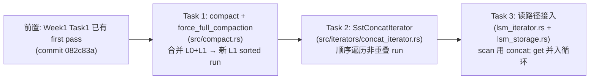
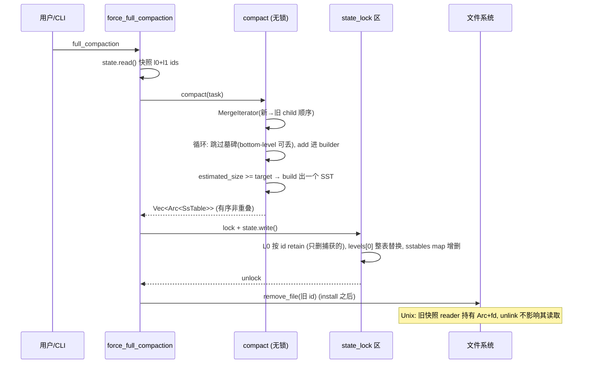

# Code Reading Report: Week 2 Day 1 — Compaction + Concat Iterator (review)

> Produced with the how-to-read-code workflow, as a **retrospective review** of code we wrote this session, not an exploration of unfamiliar code. Conclusion labels: **[verified]** = observed via test execution; **[static]** = inferred from reading.

## 1. Scope & purpose

- **Purpose** (Phase 2): 回顾 Week 2 Day 1 的全部内容——任务结构、设计决策、代码落点、验证结果、踩过的坑——把散落在对话里的结论固化成一份可复读的总结。
- **Environment**: 本地 debug build 已可运行;验证命令 `cargo test -p mini-lsm-starter week2_day1`(4/4)与 `cargo x scheck`(50/50)均已跑通。**[verified]**
- **Out of scope**: Week 2 Day 2+(simple/tiered/leveled compaction)、manifest、WAL——尚未实现。

## 2. Task structure (horizontal pass)

Day 1 三个任务,依赖关系是线性的:Task 1 产出 L1(有 compaction 才有 run),Task 2 提供读取 run 的工具,Task 3 把工具接入读路径。

**验证轨迹** [verified]:
1. Task 1 first pass(commit 082c83a)→ reveal tests → **2 pass / 2 fail**(fail 的正是未实现的 Task 2/3,预期切片边界)。
2. 实现 Task 2 + 3 → `week2_day1` **4/4**。
3. `cargo x scheck` 首跑 **fail**:`week1_day2::test_task4_integration` panic——空 L1 run 越界(见 §5)。
4. 修空 run → **50/50**,fmt/clippy 干净。

## 3. Core data structures (Phase 7)

本日新增/触及的核心结构,及其在引擎全局中的位置:

| Structure | Defined in | Created by | Role |
|---|---|---|---|
| `CompactionTask::ForceFullCompaction` | compact.rs:43 | `force_full_compaction` | 捕获 `(l0_ids, l1_ids)` 快照;**id 列表是任务所有权的凭证** |
| `LsmStorageState.levels[0]` | lsm_storage.rs:56 | install 阶段整表替换 | L1 sorted run(id 列表,有序非重叠) |
| `SstConcatIterator` | concat_iterator.rs:27 | `create_and_seek_to_*` | 单 child 游标 + `next_sst_idx` 待命指针 |
| `SsTableBuilder` 输出 | table/builder.rs | `compact` 内 | 按 `target_sst_size` 单调切分 ⇒ 输出天然非重叠 |

**关键不变量** [static,由测试间接验证]:
- 任务捕获的 id 列表 = install 时**唯一**有权删除的集合;此后 flush 的新 SST 不在其中,必然存活。
- L1 前提(有序 + 不重叠)由 compaction **构造期**保证(单次升序 merge + 单调切分),运行时零校验;本 session 补了 `debug_assert_disjoint` 把 debug 下的违约变成确定性 panic。
- 优先级全链:可变 memtable > imm memtable > L0(新→旧)> L1,靠 MergeIterator 的 index tie-break 与 TwoMergeIterator 的 A-优先层层传递。

## 4. Vertical analysis: full compaction 一次执行的完整时序

三个易错点,都已在代码中以注释/结构固化 [static]:

1. **墓碑丢弃的条件**:本任务包含"所有可能存在旧版本的层级"(bottom-level),所以墓碑赢家可直接丢弃;若只 compact 部分层级,丢弃会复活旧值。
2. **install 的原子性**:L0 用 `retain`(按 id 删),L1 用整表替换——两种更新都不会波及任务捕获后新出现的 id。
3. **删除时序**:先 install(提交点)后 unlink;读者在旧快照上持有的 `Arc<SsTable>` 打开的 fd,Unix 下 unlink 后仍可读完。

## 5. 踩过的坑与诊断记录 [verified]

**唯一真实 bug:空 L1 run 越界。**

- 现象:`scheck` 首跑 fail 于 `week1_day2::test_task4_integration`,panic 位置 `concat_iterator.rs:62`(`iter.sstables[idx]`)。
- 根因:week-1 测试无 compaction,`levels[0].1` 为空;`create_and_seek_to_key(vec![], …)` 里 `partition_point` 返回 0,`saturating_sub(1)` 仍是 0,对空 vec 索引 panic。
- 教训:**二分下标的前提是"非空序列"**——Day-4 `find_block_idx` 那套证明写满了"blocks non-empty"的前提,上移一层时前提跟着上移了,但"run 可能为空"这个新事实没有跟上。
- 修复:两个构造器各加空 run 早退(恒 invalid 迭代器)。
- 有趣之处:这个回归不是 week-2 测试抓到的,而是**week-1 老测试**抓到的——读路径的改动会反向影响所有旧场景,`scheck` 全量跑的价值正在于此。

## 6. Design commentary (Phase 8)

- **get 走老路,scan 走 concat 的不对称**:get 是单 key 点查,构造整个 run 对象不划算,把 L1 id 并入现有 `key_within + bloom` 循环(不重叠 ⇒ 至多一个 L1 候选通过过滤)零新逻辑;scan 是多 key 遍历,concat 的单 cursor 优势才能摊销。**同一个"读"在两种访问模式下走两条路**,这是本日最有味道的设计决定。
- **`debug_assert_disjoint`(本 session 增补)**:原代码对前提的唯一防御是注释;现在 debug 下违约即 panic(消息带出重叠范围),release 零成本。代价:每次构造 O(n) 次 key 比较——L1 的 n 通常很小,可忽略。**换我会做的就做这个;release 也校验则过重。**
- **与 RocksDB 的对照** [static]:RocksDB 的 universal compaction 同样以"输出天然非重叠"为前提让 read path 走 shortcut;本章的 SstConcatIterator 对应其 `SstConcatIter`,连"seek 落空跳下一 SST first entry"的细节都同构——课程在忠实缩微工业实现。

## 7. Follow-ups

- [ ] 理解题尚未完成:"为什么 concat 不能取代 L0 的 MergeIterator"(已讨论,待学生复述确认)。
- [ ] Day 2 simple leveled compaction 会把 install 逻辑换成 `CompactionController::apply_compaction_result` 泛化路径,重读 compact.rs 时关注两个策略如何共享同一段合并代码。
- [ ] `num_active_iterators` 口径问题(Merge 递归求和 vs Concat 常量 1)留待 Day 3/4 检验是否有测试裁决。
